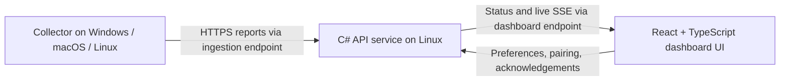

# Agent Dashboard — cross-platform architecture

**Status:** Implemented with .NET 10 and React/TypeScript. See the [migration guide](migration.md) and [adapter support matrix](adapters.md) for deployment and verification boundaries.

**Goal:** Monitor agentic work across devices and maintain **at least three parallel running tasks** by default. More than three is healthy. Show runtime, latest output, and completed tasks awaiting review.

The project has three independently runnable parts:

## 1. Dashboard UI

**Technology:** React + TypeScript, built with Vite. Runs in desktop and mobile browsers.

- Display the global running count, minimum, device health, task runtime, and latest captured output.
- Filter by device or agent without changing the global count.
- Keep a collapsible completion inbox: newest five initially, Show more, and Clear to acknowledge.
- Manage preferences and device enrollment. Show in-page reminders and optional browser notifications while connected.

The UI consumes typed API clients generated from OpenAPI. It does not read local agent files or contain collector credentials. Its static assets can be served alongside the API behind the dashboard endpoint.

## 2. API service

**Technology:** C# / ASP.NET Core. Linux is the preferred host; Windows and macOS are also supported.

- Own device registration, scoped credentials, heartbeat expiry, aggregation, preferences, and the persisted completion inbox.
- Expose separate **ingestion** and **dashboard** interfaces with different permissions. Collectors may report only their own device; authenticated dashboard users may view and manage their workspace.
- Count tasks from online devices. Missing heartbeats mark a device offline, not completed. Namespace task IDs by device and source; deduplicate retried completion events.
- Publish live updates with SSE. Use background workers for expiry checks and reminder scheduling; a Linux server must not depend on Windows notifications.

Use SQLite initially for a single-server deployment. The API service requires no agent applications installed. If its machine runs agents, deploy a separate collector there too.

## 3. Collector

**Technology:** C# / .NET worker or console application, packaged for Windows, macOS, and Linux.

- Run one collector per device with a persistent identity and locally protected credentials.
- Read Codex, GitHub Copilot, and Claude Code through adapters with OS-specific paths and process handling.
- Prefer explicit lifecycle signals; report uncertainty and retain manual reporting where reliable automatic detection is unavailable. Process presence alone is not proof of active work.
- Send outbound heartbeats, task snapshots, and completion events. Retry safely and retain pending completions locally until acknowledged.

No inbound tunnel is required on collector devices. Cross-platform .NET support does not guarantee each agent integration works on every OS; validate and document the adapter support matrix.

## Deployment and migration

Initially retain two authenticated persistent Dev Tunnels: one for ingestion, one for the UI and dashboard API. Keep transport configurable so a Linux deployment can use ordinary HTTPS domains later. Preserve device-scoped authentication independently of the tunnel provider.

The migration preserves versioned JSON routes, imports legacy state into SQLite, and separates the original host collector from the API. Backend tests and collector packaging run on all three operating systems; vendor-local data readers are fixture-tested across platforms and live-checked where an installation is available.
