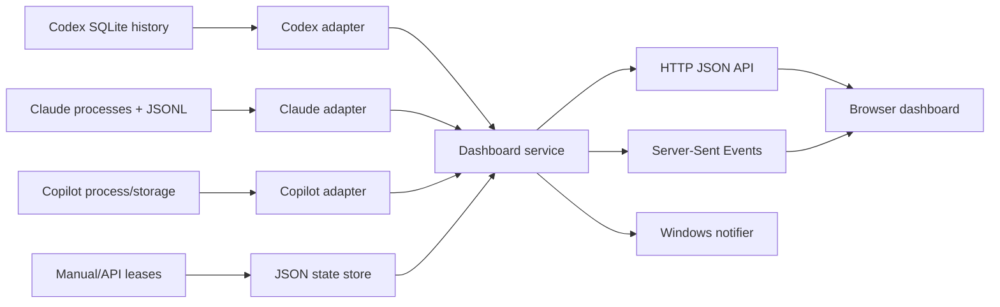

# Agent Dashboard design

## Purpose

Agent Dashboard is a local service that answers one operational question: **are at least N agentic tasks running right now?** The default target is three. It combines status from Codex, GitHub Copilot, and Claude Code, presents a live browser dashboard, and reminds the user when confirmed capacity falls below the target.

The service is intentionally local-only and dependency-light. It uses Node.js built-in modules, reads local application state, and binds to `127.0.0.1`.

The service also acts as a central hub. Its UI and device-ingestion APIs listen on separate loopback ports, each with its own private Dev Tunnel. Remote collectors push authenticated snapshots; the hub aggregates online devices against the global minimum. See [multi-device design](multi-device.md) for enrollment, device identity, offline handling, and delivery semantics.

## System overview

Every poll builds a fresh snapshot. The snapshot contains source availability, all confirmed running tasks, the configured minimum, and the number of missing tasks.

## Runtime flow

1. `src/server.mjs` starts an HTTP server on `127.0.0.1:4317`.
2. Every two seconds, `DashboardService.refresh()` polls all adapters and reads reported tasks from the store.
3. The service merges automatic and reported tasks, then counts items whose status is `running`.
4. If the meaningful state changed, the server publishes a new SSE snapshot to connected browsers.
5. If the count is below the configured minimum, the notifier sends a Windows toast subject to its cooldown.
6. The browser updates task rows immediately. Elapsed timers update locally every second, without requiring one server request per second.
7. When an observed task disappears, or a reported task is marked completed, the store adds it to a persisted completion inbox.

## Status model

Tasks have these important fields:

| Field | Meaning |
|---|---|
| `source` | `codex`, `copilot`, or `claude` |
| `status` | `running`, `completed`, `paused`, or `stale` |
| `confidence` | `automatic` when derived from app state; `reported` when created through a lease |
| `startedAt` | Used for the live elapsed timer |
| `latestOutput` | Latest safe assistant text or reporter-supplied progress |
| `expiresAt` | Deadline after which a reported running task becomes stale |

Only `running` tasks count toward the capacity target. Source availability, such as “Copilot is installed,” never counts as a running task.

## Adapter designs

### Codex

The Codex adapter opens two local SQLite databases read-only:

- `~/.codex/thread_history_1.sqlite` provides `thread_turns` and `thread_items`.
- `~/.codex/state_5.sqlite` provides thread title, workspace, model, and reasoning effort.
- `~/.codex/session_index.jsonl` provides the current sidebar `thread_name`, including generated or user-renamed task names.

An automatic running task is created for every `thread_turns` row whose status is `inProgress`. Its start time comes from `started_at`. The latest output is the newest `agentMessage` in the same turn; tool calls, command output, and user messages are deliberately excluded.

For display, the adapter prefers the session index's `thread_name`, then the database `name`, then the original prompt-derived `title`. This keeps dashboard task names aligned with the Codex sidebar while retaining fallbacks for old sessions.

Some legacy or long-lived Codex threads are not projected into `thread_history_1.sqlite`. For recent threads with no projection rows, the adapter tails the thread's rollout JSONL and compares the latest `task_started` event with subsequent `task_complete` or `turn_aborted` events. This fallback also extracts the latest assistant message and is merged without double-counting projected threads.

This is the strongest integration because Codex persists an explicit turn status. The databases are implementation details rather than a guaranteed public API, so the adapter fails soft if a schema changes. Other adapters and the reporting API continue working.

### GitHub Copilot

The Copilot adapter checks two signals:

- whether VS Code's `github.copilot-chat` global storage exists;
- whether a process with `copilot` in its process name is active.

These signals establish availability, not active agent-task state. Copilot's local session store records history but does not expose a stable, authoritative running flag. Consequently, Copilot tasks use explicit leases created by the dashboard or API.

A lease has a finite duration. A caller can renew it with a heartbeat and optionally update `latestOutput`. If heartbeats stop, the task becomes `stale` and no longer contributes to capacity. This avoids permanently counting abandoned work.

### Claude Code

The Claude adapter combines two local signals:

- live `claude.exe` processes provide authoritative process presence and process start time;
- recent `~/.claude/projects/**/*.jsonl` session files provide the session title, workspace, and latest assistant text.

Each active process becomes one automatic running task. It is paired with a session updated after the process started, allowing a ten-minute tolerance for startup/session creation timing. The JSONL reader scans only the last 512 KiB of candidate files, tolerates a partially written final line, and extracts only text messages needed by the UI.

Process presence is not identical to “the model is currently generating”; an idle interactive Claude Code process can still be counted. A manual Claude lease is available when process/session matching is unavailable.

## Live output and timing

See [Interface design](interface.md) for the visual system, responsive layout, task filters, completion disclosure, and UI verification workflow.

The server sends `startedAt`, `latestOutput`, and `latestOutputAt`. The browser calculates the current elapsed duration from `startedAt` and refreshes it every second. This keeps network and database polling at two-second intervals while making the timer appear continuous.

Latest output is capped at 2,000 characters in the API. Running cards show a three-line preview and completion rows show two lines. Task details reveal the complete captured text. This is a progress preview rather than a terminal stream.

## Persistence and leases

`src/store.mjs` persists settings and manually reported tasks in `data/state.json`. Writes use a temporary file followed by a rename so a partial write does not corrupt the primary file.

When a snapshot is requested, expired running leases are converted to `stale` before counting. A task heartbeat performs three operations atomically from the service's perspective:

1. marks the task `running`;
2. advances `expiresAt`;
3. records optional latest output.

Automatic running tasks are reconstructed from source application state on each refresh. The store persists a compact snapshot of the last observed automatic task set. When a previously running item disappears, it becomes a completion notification with its title, source, workspace, runtime, and last output. This observation state survives service restarts.

Clearing a completion only acknowledges the local dashboard notification; it does not delete Codex, Copilot, or Claude history.

The completed-task panel is collapsible and renders the five newest unread completions initially. The browser reveals five more at a time without changing the server API or acknowledgement state.

## API and event contract

| Endpoint | Purpose |
|---|---|
| `GET /api/status` | Complete current snapshot |
| `GET /api/events` | SSE stream of meaningful snapshot changes |
| `PUT /api/settings` | Update minimum count and reminder cooldown |
| `POST /api/tasks` | Create a reported task lease |
| `PATCH /api/tasks/:id` | Change task status, title, or latest output |
| `POST /api/tasks/:id/heartbeat` | Renew a lease and optionally publish progress |
| `DELETE /api/completions/:id` | Acknowledge one completion notification |
| `DELETE /api/completions` | Acknowledge all completion notifications |

SSE events are named `snapshot`. The server excludes `generatedAt` when deciding whether state changed, preventing useless UI updates every polling cycle.

## Reminder behavior

The notifier tracks whether capacity was previously healthy and when it last sent an alert. It alerts immediately on entry into a below-target state, then repeats only after the configured cooldown while the deficit persists.

On Windows, `scripts/notify.ps1` uses the native toast API. The browser also displays an in-page warning and can request browser notification permission when settings are saved.

## Security and privacy

- The HTTP listener binds only to loopback, not the LAN.
- Local collection uses no model API or telemetry service. Optional remote hosting and collectors use Microsoft Dev Tunnels authentication, and device credentials are stored only in ignored local files.
- Source databases and logs are opened read-only.
- Latest-output extraction excludes raw tool output and user messages.
- HTTP responses include a restrictive Content Security Policy and `X-Content-Type-Options: nosniff`.
- UI content is HTML-escaped before rendering.
- Request bodies are limited to 64 KiB.

The application listener remains loopback-only. Optional Microsoft Dev Tunnels hosting uses the tunnel owner's Microsoft authentication for remote access. The server checks tunnel and port access rules before hosting and rejects expanded/anonymous access or extra ports. See [Remote access](remote-access.md) for startup, expiration renewal, sign-in, and verification. The app itself does not implement a second identity system.

## Failure handling

Each adapter returns an availability flag and diagnostic detail instead of crashing the service. If an application's files are absent, locked, malformed, or changed by an update, its source card reports the problem while other sources remain operational.

The principal compatibility risk is reliance on undocumented local storage schemas. Tests cover parsing and status selection, but upgrades to Codex, Copilot, or Claude Code may require adapter changes.

## Extending the system

To add another agent source:

1. Add `src/adapters/<source>.mjs`.
2. Return `{ available, detail, tasks }`, with tasks following the common status model.
3. Merge its tasks and source status in `src/service.mjs`.
4. Add a source card to `public/index.html` and include it in the rendering loop.
5. Add parser/detection tests using synthetic fixtures; do not depend on a developer's real application data.

Prefer an explicit task/turn status API when available. Use process presence only when the process corresponds closely to one task. Use leases when neither source can reliably distinguish running work from installed or idle state.

## Possible next steps

- Add a small VS Code extension that reports Copilot chat lifecycle events automatically.
- Add per-source include/exclude controls for the global minimum (display filters currently leave it unchanged).
- Store recent task-completion history for throughput and utilization charts.
- Add an authenticated LAN mode for monitoring several machines.
- Replace implementation-detail adapters if vendors publish supported task-status APIs.
