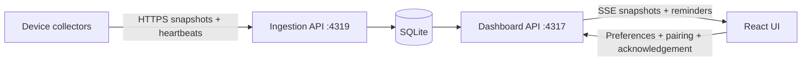

# Agent Dashboard design

The system has three parts: a React/TypeScript dashboard, an ASP.NET Core API service, and a standalone .NET collector. The API can run on Linux without agent applications; collectors run on Windows, macOS, and Linux. See [the one-pager](architecture-onepager.md).

## Data flow

The global minimum defaults to three. All online devices contribute; four or more tasks is healthy. UI filters never alter the global count.

## API service

- Two Kestrel listeners enforce route separation by local port. The ingestion listener cannot serve UI or administrative APIs.
- The UI uses a service access key, an HTTP-only signed session cookie, and JSON-only mutations. Login and enrollment are rate limited. The access key is stored outside Git or supplied through DASHBOARD_ACCESS_KEY.
- Pairing codes last ten minutes, are single-use, and are stored hashed. Each device receives a scoped token whose hash is stored by the service.
- Collector sessions supersede older processes. Increasing sequence numbers prevent out-of-order snapshots; exact retries are acknowledged without extending device liveness.
- A device becomes offline 45 seconds after the last new accepted report. Offline tasks become stale; missing heartbeats never create completions.
- Task IDs include the device ID. The same session identifier on separate devices does not collide.
- Completion-event IDs are retained separately from unread notifications, so acknowledgements survive replay and service restart.

SQLite stores a versioned aggregate document inside a transaction. WAL and atomic commits protect updates. This implementation is intended for one API process, not distributed concurrent writers. No unread completion is silently evicted; plan archival before using it as a high-volume event store.

## Collector

Collectors send outbound HTTPS reports, with Dev Tunnels authentication when a tunnel ID is configured. They can also target an ordinary HTTPS origin. Redirects are not followed and credentials cannot move to another origin. HTTP is permitted only on loopback.

Adapters read source data without writing it. Explicit lifecycle events identify completed tasks; process presence alone never counts as active generation. The collector persists observations, manually reported leases, completion deduplication, and an outbox in its own SQLite file. Successfully acknowledged batches leave the outbox; failed reports retain the same sequence and payload for retry. See [adapter support](adapters.md).

## UI and contracts

The React app uses strict TypeScript and OpenAPI-generated definitions with openapi-fetch. contracts/openapi.json comes from ASP.NET Core endpoint types; web/src/generated/api.ts is generated from that schema. Rendered output is plain text. The responsive interface retains 16px updates, 17px task titles, device/source/search filters, timers, details, and the collapsible five-item completion inbox.

## Reminders

A hosted background worker evaluates the global minimum every two seconds. It publishes a reminder when the count falls below the minimum and at the saved repeat interval while below it. New connected browsers receive the current below-minimum reminder. The browser shows a toast and an OS browser notification if allowed. Closed/suspended browser delivery is not supported; the Linux API has no dependency on Windows toast APIs.

## Deployment

[Remote access](remote-access.md) describes the two private persistent tunnels and ordinary reverse-proxy hosting. [Migration and rollback](migration.md) describes preserved Node state and cutover. The .NET API and collector are separate executables; Node.js is used only to build/develop the frontend.
