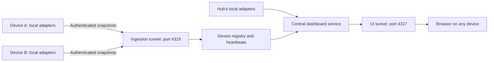

# Central dashboard and device collectors

The central service combines agents from several computers into one running count. The minimum remains global: with a minimum of three, two tasks on a laptop and one on a desktop meet it. More than three is healthy.

## Two separate tunnels



The existing UI URL stays unchanged. A second persistent tunnel forwards to a separate ingestion listener. Query `GET /api/tunnels` on the UI service to discover both URLs. Both tunnels retain Microsoft owner-only authentication, renewal, and reconnection.

- The **UI listener** serves the website, aggregate status, SSE, settings, acknowledgement, pairing-code creation, and device disconnection.
- The **ingestion listener** exposes only `/health`, registration, collector sessions, and snapshots. It cannot read the aggregate inbox or change dashboard preferences.
- Each device sends snapshots outbound to the common ingestion URL. Devices do not need their own inbound tunnels, and the hub does not poll arbitrary remote URLs. Existing per-device tunnels can coexist but are not used by this collector.

The old single-tunnel configuration remains supported as UI-only configuration. For dual hosting use `tunnel.example.json` with distinct `ui` and `ingestion` objects. The port numbers must match `port` and `ingestionPort` in the dashboard configuration.

## Connect another computer

1. Start the central service with `npm start` or `npm run start:background`. Open the dashboard's **Devices → Connect device** button.
2. On the other computer, clone this repository and install Node.js 22.5+ and Microsoft Dev Tunnels. Sign into the tunnel owner's Microsoft account with `devtunnel user login --entra`.
3. Run the setup command displayed in the pairing dialog, for example:

```powershell
npm run device:enroll -- --url https://INGESTION-HOST-4319.CLUSTER.devtunnels.ms --tunnel-id INGESTION-ID.CLUSTER --name "Work laptop"
```

4. Paste the one-time code at the prompt. The code expires after ten minutes. Enrollment writes a private, ignored `collector.json` file with the device identity and credential.
5. Run `npm run collector` and leave it running. Restarting it reuses the enrolled device identity. Do not run two collectors using the same credential; a new collector session replaces the old one.

Run the collector, not another central service, on each additional computer. The hub already collects its own local tasks, so enrolling the hub too would duplicate its work. Enrollment is required once per device. There is no automatic OS-startup installation.

The current collector reuses Codex and Claude local adapters. Copilot retains the existing reporting limitation: it does not automatically expose task lifecycle events. The separate `data/collector-state.json` file can retain reported task leases, but the collector does not run a remote control API. This change does not add a Copilot IDE extension.

## Device state and correctness

Each enrollment receives a random device ID and a scoped secret. Only its hash is stored at the hub. The secret allows writes only to that device; it is never included in UI snapshots. Pairing codes are single-use and also stored hashed.

The collector opens a server-issued session and sends full snapshots about every ten seconds. The hub uses **receipt time**, not device clocks, for its 45-second liveness window. After that, the device appears offline and its last running tasks become stale and stop contributing to the global total. Offline is not completion.

Task keys include the device ID plus the source adapter's task ID. Matching thread IDs on different computers therefore cannot collide. If the same work is intentionally mirrored on two devices it counts twice; there is no cross-machine semantic deduplication.

Sessions and monotonically increasing sequence numbers fence older collectors and reject out-of-order data. Retrying an accepted sequence does not extend its heartbeat. Collector retries preserve the same payload until acknowledged. Auth tokens for the private ingestion tunnel are acquired with the Dev Tunnels CLI and cached only in memory for an hour; device credentials remain in ignored local configuration.

## Completion inbox

Collectors retain locally observed completion events until the hub acknowledges a report. The hub stores device identity, workspace, start time, completion time, and captured output with the event. The collector then removes the delivered event from its local outbox.

The registry keeps processed completion IDs separately from unread notifications. Clearing a notification on the dashboard therefore remains effective after network retries or a hub restart. Remote task disappearance alone never fabricates a completion; only a collector completion event enters the inbox. Those events retain the existing adapters' limitations, including inferring local completion from disappearance and possibly missing tasks that both start and finish between polls.

The local inbox and remote inbox each retain up to 100 unread entries. Collectors retain up to 100 pending completion events. This is a personal monitoring service, not a durable high-volume event archive; long outages beyond these limits can lose older completion notifications. Device status and the most recent snapshot survive hub restarts.

## UI

Devices show their name, online/pending/offline state, last heartbeat, and running count. Every task and completion carries a device label. The device selector combines with agent filters and search. Filters affect the visible lists; the minimum indicator always reflects all online devices. Remote tasks can be inspected and their completions acknowledged, but marking a reported task complete from the hub is limited to hub-local tasks. Disconnect revokes a remote device's credential and excludes its tasks; existing completion notifications remain available.

## API

| Listener | Method and route | Purpose |
|---|---|---|
| UI | GET /api/tunnels | Both tunnel states and URLs |
| UI | POST /api/devices/pair | Create a ten-minute pairing code |
| UI | DELETE /api/devices/:id | Revoke a remote device |
| Ingestion | GET /health | Generic liveness, no task data |
| Ingestion | POST /v1/devices/register | Exchange code and name for device credentials |
| Ingestion | POST /v1/devices/:id/sessions | Start one active collector session |
| Ingestion | PUT /v1/devices/:id/snapshot | Publish sequence, source health, tasks, completion events |

Collector requests use `Authorization: Bearer DEVICE_TOKEN` plus `X-Tunnel-Authorization: tunnel CONNECT_TOKEN` through Dev Tunnels. Registration uses the pairing code in JSON instead of a device token. Remote collectors currently require sign-in to the same Microsoft account as the tunnel owner. Different-account deployments need a separate reviewed access model; anonymous tunnel access is not enabled.

The ingestion server rejects browser Origin headers, accepts bounded JSON bodies, validates report fields, and ignores device-provided identity labels in favor of the registered identity. It never dereferences workspace paths or URLs from reports. No collector endpoint grants command execution.

## Verification and operations

Run `npm test` for enrollment, expiry, collision, replay, restart, revocation, HTTP isolation, and aggregation checks. `node scripts/verify-ingestion.mjs` temporarily enrolls a synthetic device over the real tunnel, verifies task merging, then revokes it. It never prints device credentials.

The original UI verification remains `node scripts/verify-tunnel.mjs`. Logs are under `data/`. To run a hub without scanning local apps, set `collectLocal: false` in `config.json`. Default names use the host name; configure `deviceName` before first hub startup or choose a name at remote enrollment. Local data, registration hashes, collector credentials, pairing codes, and tunnel configuration must stay out of Git.

For isolated diagnostics, `AGENT_COLLECTOR_CONFIG` and `AGENT_COLLECTOR_STATE` override the enrollment/configuration file and collector outbox respectively. `npm run collector -- --once` sends one snapshot and exits. These overrides are used by the CLI integration test without touching the real device enrollment.
